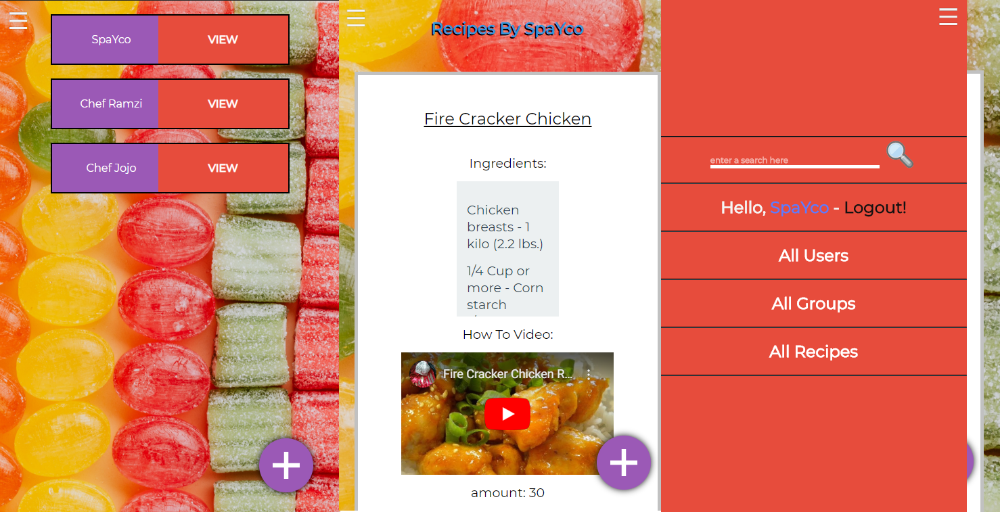

## Katchy
- This is a website for Creating Recipes

## What it does
- Create Users
- Create a group where you can add recipes in
- Create Recipe pages where you show the ingredients, and link a video showing how you do it

## Built With
- Ruby
- Ruby on Rails
- VSCode

## Deployment

You can check a live demo [HERE](https://hidden-fjord-31358.herokuapp.com/)

## Setup

Install gems with:

```
bundle install
```

Setup database with:

```
   rails db:create
   rails db:migrate
```

## Usage

Start server with:

```
    rails server
```

Open `http://localhost:3000/` in your browser.

## Run tests

```
    RSpec
```

## Authors

👤 **SpaYco**

- Github: [@SpaYco](https://github.com/SpaYco)
- Twitter: [@iSpaYco](https://twitter.com/iSpaYco)
- Linkedin: [Aziz Mejri](https://www.linkedin.com/in/spayco/)
- Hackernoon: [@SpaYco](https://hackernoon.com/@SpaYco)

## Credits


Design idea by [Gregoire Vella on Behance](https://www.behance.net/gregoirevella) - [Snapscan IOS Design and Branding](https://www.behance.net/gallery/19759151/Snapscan-iOs-design-and-branding?tracking_source=)

a Special thanks to @eduardinni for making a ruby method that grabs IDs from any YouTube links, check it out [here](https://gist.github.com/eduardinni/ff0011ba8c411fa06253c1d5850373cf)

## 🤝 Contributing
Contributions, issues, and feature requests are welcome!

## Show your support
Give a ⭐️ if you like this project!

📝 License

Check out my stories on medium to see what I'm talking about! Follow me on Instagram and Twitter to see what I am up to!

Enjoy!
